Neste tutorial vamos explorar o uso de **agentes de IA personalizados** — agentes de IA configurados para assumir papéis específicos e te ajudar em tarefas concretas de desenvolvimento. Para isso, vamos usar o **BMAD**, uma metodologia (framework) de desenvolvimento impulsionada por um conjunto de agentes prontos que cobre todo o ciclo de criação de um software: da ideia ao código. Como exemplo prático, vamos acompanhar a construção do **agenda-clean**, um sistema real de agendamento para uma empresa de limpeza de sofá, construído do zero com esses agentes — para que você veja cada conversa, cada decisão e cada artefato gerado ao longo do caminho.

---

## Sumário

- [Preparação: Ambiente e Instalação](#preparação-ambiente-e-instalação)
- [Entendendo as Fases do Processo](#entendendo-as-fases-do-processo)

---
## Preparação: Ambiente e Instalação

Antes de qualquer coisa, abra o terminal na sua máquina.
No Windows, pressione `Windows + R`, digite `cmd` e pressione `Enter`; isso abrirá o Prompt de Comando.
No Linux e macOS, abra o aplicativo Terminal.

Agora verifique se as ferramentas necessárias estão instaladas:

**Ver se o nodeJS está instalado**

```bash
node -v        # precisa ser v18 ou superior
```

Se não aparecer `node v.XX.x.x`, instale em [nodejs.org](https://nodejs.org). Escolha a versão **v24.x.x (LTS)**.

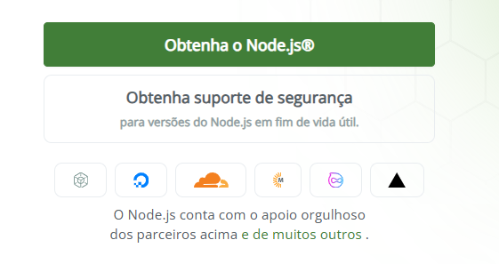
--
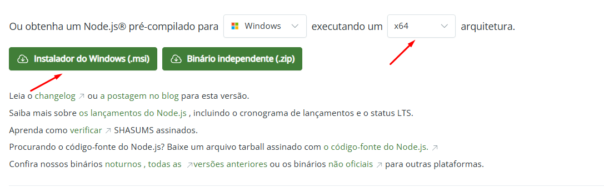

Siga o fluxo de instalação clicando em `Next` até finalizar.

Durante a instalação pode aparecer uma janela de consentimento perguntando se aceita instalar o programa no seu computador. Aceitar e seguir

Após a instalação completa, feche o Prompt de Comando  e abra de novo. O comando não irá funcionar se não reiniciar. Rode `node -v` novamente e verifique se retornou.

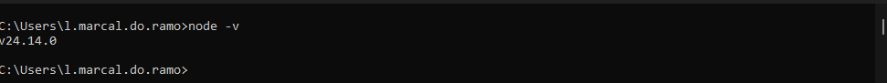

**Com o nodejs instalado, vamos ver agora o npm.**

```bash
npm -v         # vem junto com o Node
```

Deve aparecer algo como `npm v.11.9.0`; se não aparecer, confira a instalação do Node.js no passo anterior.

```bash
C:\Seu usuario>npm -v
11.9.0
```

**Agora o git, nosso controle de versão. Vamos testar se já está instalado**

```bash
C:\Seu usuario>git --version
git version 2.40.0.windows.1
```

Deve aparecer algo como `git version 2.43.0`; se não aparecer, instale em [git-scm.com](https://git-scm.com/install/) e escolha a versão x64.

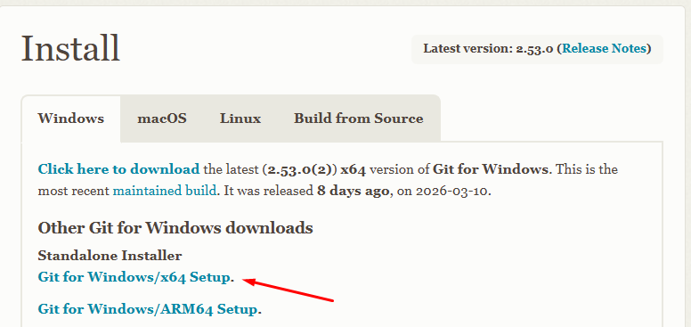

Ir dando `Next` até a tela abaixo, onde deve escolher Use Windows default console window.

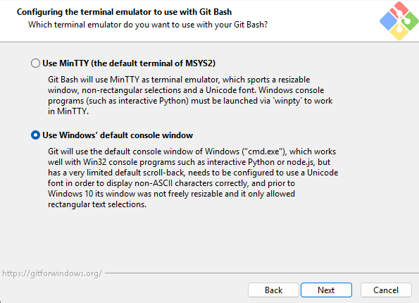

Ao finalizar a instalação, feche o Prompt de Comando e abra de novo. Depois teste novamente. Se aparecer algo assim, Git instalado!

```bash
C:\Seu usuario>git --version
git version 2.53.0.windows.1
```

**Vamos ver se o Docker está instalado.**

```bash
 # testar se o docker está instalado

C:\Seu Usuario> docker -v

#caso apareça uma mensagem como abaixo

'docker' is not recognized as an internal or external command,
operable program or batch file.

#precisa instalar o docker. veja abaixo como instalar
```

Se algum desses falhar, instale antes de continuar. Docker Desktop em [docker.com](https://www.docker.com/products/docker-desktop).

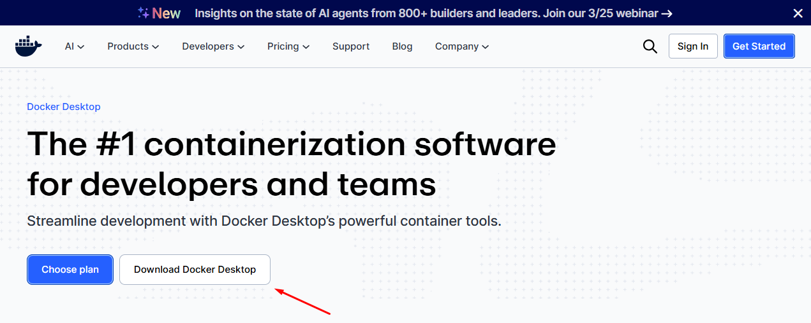

### Tem uma IDE instalada? ###

 Vscode, Cursor, Visual Studio, etc? Caso não tenha, instalar o Vscode em [code.visualstudio.com](https://code.visualstudio.com/download).

Após essas ferramentas instaladas, temos o básico para continuar o processo.

### Mas o que é um agente de IA?

Um **agente de IA** é uma instância de um modelo de linguagem (como o GitHub Copilot) que recebe um conjunto de instruções específicas — um papel, um objetivo, um jeito de trabalhar — e age de acordo com elas. Em vez de conversar com um assistente genérico que faz de tudo, você conversa com um especialista configurado para aquela função: ele sabe o que perguntar, o que produzir e quando parar. No contexto do BMAD, cada agente é acionado por um comando no Copilot Chat e assume um papel diferente conforme a etapa do projeto.

 ### E o BMAD?

Pense no BMAD como um **time virtual de especialistas** que vai te acompanhar durante todo o desenvolvimento do projeto. Em vez de você tentar resolver tudo sozinho — o problema de negócio, o design, a arquitetura, o código — o BMAD coloca um especialista diferente em cada etapa: tem o analista que te ajuda a entender o problema, o designer que define como o app vai parecer, o arquiteto que decide a tecnologia, e o dev que realmente escreve o código. Cada um desses "especialistas" é um agente de IA que você aciona pelo GitHub Copilot, e eles conversam com você em linguagem natural, fazem perguntas, tomam decisões e produzem documentos reais que ficam salvos no seu projeto.

Próximo passo é instalar o BMAD

### Instalando o BMAD

No Prompt de Comando do seu sistema, crie uma pasta para o agenda-clean. É nela que todo o projeto será armazenado e onde o BMAD será instalado.

```bash
mkdir agenda-clean
cd agenda-clean
```

Com a pasta criada, vamos abrir o VS Code já na pasta atual (`agenda-clean`).

```bash
code . 
```

Agora, dentro do VS Code, abra uma janela do terminal usando o atalho `Ctrl + shift + '`. 
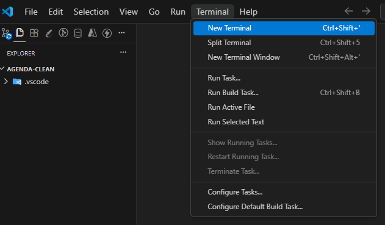

Escolha o command promt como tipo de terminal conforme imagm abaixo.

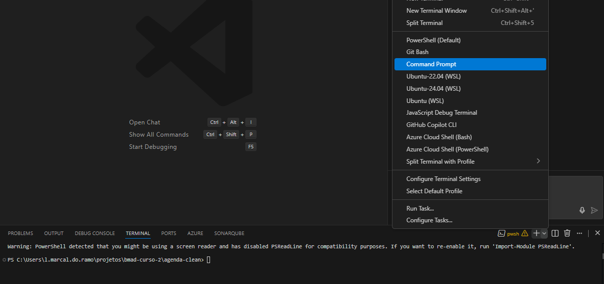

Dentro deste terminal digite o comando

```bash
npx bmad-method@latest install
```

O instalador vai fazer algumas perguntas. Responda assim:

```bash
* Instalation directory: aceitar padrão (Enter)
* Install to this directory: yes (Enter)
* Select models to install: 
#Para navegar utilize as setas, selecionar utiliza barra de espaço e para confirmar Enter

# Escolher 
[x] Bmad Core Module
[x] Bmad agile IA drive Development. 
```
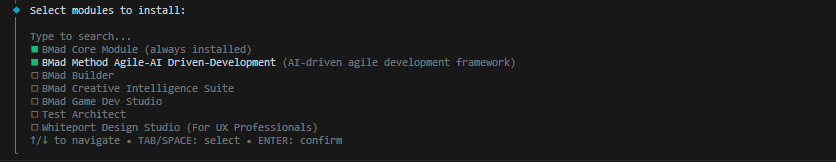

```bash
* Add custom modules, agents, or workflows from your computer? No (Enter)
* Integrate with 
#Para navegar utilize as setas, selecionar utiliza barra de espaço e para confirmar Enter
[x]Claude 
[x]Github copilot 
```
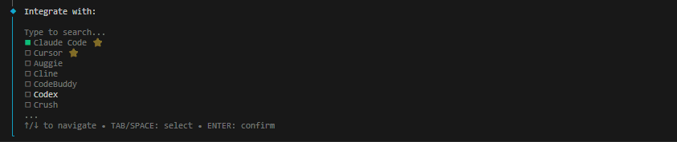

Usar seta para baixo ⬇️ para navegar entre as opções. e `Enter`para confirmar
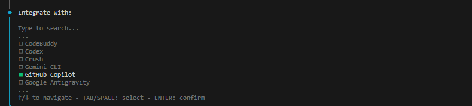


```bash
* What is your project name?  → agenda-clean
* What Should agents call you?   → (seu nome)
* What languages should agents use when chatting with you?  → Portugues Brazil
* Prefered document output language?  → Portugues Brazil
* Where should output files be saved? aceitar padrão (Enter)
* Model configuration? Express
```

O processo vai iniciar.


Quando terminar
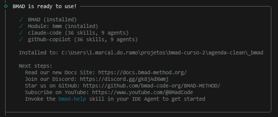

 você vai ver uma pasta `_bmad/` criada no projeto.
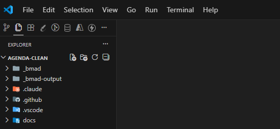

**Reinicie o VS Code.** 

Abra uma janela do Copilot Chat. Atalho `Ctrl +Alt + I`

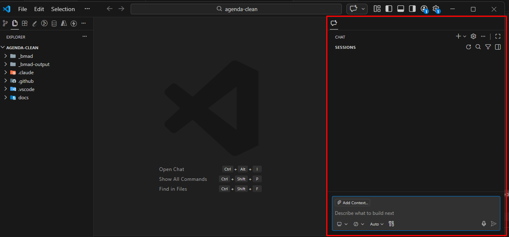

Se tudo funcionou bem e você está na janela do Copilot Chat...

Selecione o modo Agent no Copilot Chat.

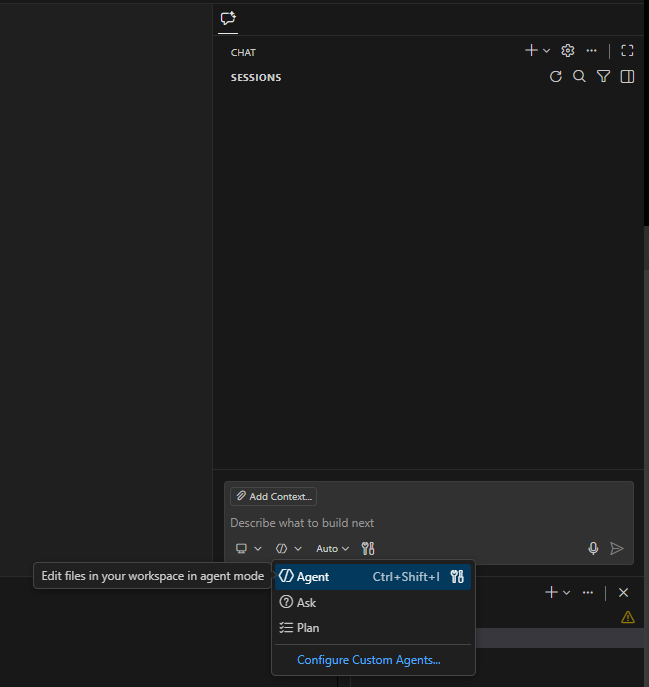


Na janela do Copilot Chat do VS Code digite `/bmad-analyst`. Você deve digitar e os comandos bmad devem aparecer ao digitar. 

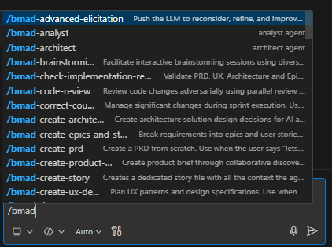

 Se o agente responder algo semelhante a isso:

`Olá, {{seu nome}}! 📊 Sou a Mary, sua Analista de Negócios. Estou aqui para transformar ideias vagas em insights concretos — adoro um bom mistério de negócio para desvendar!`

`Sucesso!! O BMAD está instalado e pronto para uso!`

---

## Entendendo as Fases do Processo

O BMAD organiza o desenvolvimento em **4 fases**. Nem tudo é obrigatório — o que você precisa executar depende do tamanho e complexidade do projeto.

### Fase 1 — Analysis *(opcional)*

A fase de análise existe para você entender bem o problema **antes** de escrever qualquer requisito. Tudo aqui é opcional, mas o Product Brief é recomendado como ponto de partida para qualquer projeto que não seja trivial.

- **Brainstorming** *(opcional)* — Sessão facilitada de geração de ideias. Agente: Mary (Analyst)
- **Research** *(opcional)* — Pesquisa de mercado, concorrência e viabilidade técnica. Agente: Mary (Analyst)
- **Product Brief** *(recomendado)* — Documento-base que resume o problema, as personas e a proposta de valor. Agente: Mary (Analyst)

### Fase 2 — Planning *(obrigatório)*

Aqui os requisitos são formalizados. Sem essa fase, o Dev não tem base para implementar nada.

- **PRD** *(obrigatório)* — Lista todos os requisitos funcionais e não-funcionais do produto. Agente: John (PM)
- **UX Design** *(obrigatório se o projeto tiver interface)* — Define identidade visual, design system e fluxos de tela. Agente: Sally (UX Designer)

### Fase 3 — Solutioning *(obrigatório no BMAD Method)*

As decisões técnicas são tomadas aqui. O código só começa depois que essa fase estiver completa.

- **Arquitetura** *(obrigatório)* — Stack, banco de dados, estrutura de pastas, padrões de API. Agente: Winston (Architect)
- **Épicos e Stories** *(obrigatório)* — Quebra do trabalho em unidades implementáveis com critérios de aceitação. Agente: John (PM) + Bob (SM)
- **Implementation Readiness Check** *(altamente recomendado)* — Valida que todos os documentos de planejamento estão coerentes entre si antes de começar a codar. Agente: Winston (Architect)

### Fase 4 — Implementation *(obrigatório)*

O código é escrito story a story, seguindo o que foi planejado nas fases anteriores.

- **Sprint Planning** *(obrigatório)* — Inicializa o arquivo de rastreamento do sprint. Agente: Bob (SM)
- **Dev Story** *(obrigatório, por story)* — Implementa cada story com testes. Agente: Amelia (Dev)
- **Code Review** *(recomendado, por story)* — Valida a qualidade do código implementado. Agente: Amelia (Dev)
- **Retrospectiva** *(recomendado, por épico)* — Revisão ao final de cada épico. Agente: Bob (SM)

---

### Resumo visual

```
Fase 1 — Analysis      [OPCIONAL]
  └── Product Brief    ← recomendado
  └── Brainstorming    ← opcional
  └── Research         ← opcional

Fase 2 — Planning      [OBRIGATÓRIO]
  └── PRD              ← obrigatório
  └── UX Design        ← obrigatório se tiver interface

Fase 3 — Solutioning   [OBRIGATÓRIO no BMAD Method]
  └── Arquitetura      ← obrigatório
  └── Épicos + Stories ← obrigatório
  └── Readiness Check  ← altamente recomendado

Fase 4 — Implementation [OBRIGATÓRIO]
  └── Sprint Planning  ← obrigatório
  └── Dev Story        ← obrigatório (repetir por story)
  └── Code Review      ← recomendado
  └── Retrospectiva    ← recomendado (por épico)
```

> **No agenda-clean**, para o nosso curso, **todas** as **4 fases** serão executadas na ordem. É esse percurso completo que vamos acompanhar nas etapas a seguir.

---


## Etapa 0 - Início + Bônus (bmad-help)

Agora que entendemos por quais etapas vamos passar e o que cada uma representa, vamos começar a usar o BMAD de fato.

Antes de entrar nas etapas, é importante conhecer o `/bmad-help`. Ele é um assistente de orientação que você pode usar a qualquer momento, de dentro de qualquer agente, para perguntar o que fazer a seguir.

```bash
#Você pode usá-lo de forma genérica
/bmad-help

#ou combinado com o que está tentando resolver, por exemplo:
/bmad-help tenho um brief pronto, qual é o próximo passo?

/bmad-help não sei se minha ideia precisa de análise de mercado
```

O agente ativo vai responder com uma orientação contextual baseada na fase em que você está, ajudando você a não se perder no processo.

Então, vamos colocar a mão na massa!

---

## Etapa 1 — Análise: A Mary descobre o problema - Briefing

### Por que começar pela análise?

Sabemos que a tentação é abrir o Copilot e já começar com um comando do tipo: ***"criar um site de agendamento de limpeza de sofá"*** ou, para alguns, seria: ***"crie o banco de dados com os campos de usuário, tipo de sofá e data"***, ou ainda, ***"desenhe a tela do formulário de pedido"***. Mas sem entender **o problema real**, você vai construir a solução errada. A Mary existe para forçar essa reflexão antes de qualquer decisão técnica.

Normalmente, em um projeto completo, escolheriamos  a opção de criar um **Product Brief** (geralmente opção `CB` ou número correspondente).

!Para efeito desse projeto vamos trabalhar com um briefing pronto, já definido e enviado pelo cliente.

Vamos copiar o arquivo product-brief-agenda-clean-2026-03-10.md para a pasta raiz do projeto.

---

## Etapa 2 — PRD: O John formaliza os requisitos

### Por que precisamos do PRD?

O Product Brief diz "o quê" em linguagem de negócio. O PRD transforma isso em **requisitos mensuráveis** que o Arquiteto e o Dev vão usar. Sem o PRD, o Arquiteto não sabe o que precisa suportar, e o Dev não sabe quando uma story está pronta.

### Acionando o John

```
/bmad-agent-pm #product-brief-agenda-clean-2026-03-10.md
```

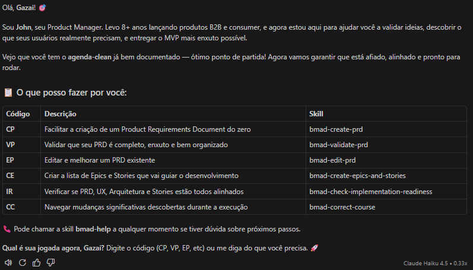

Selecione a opção de **criar PRD**  (CP) e passe o caminho do arquivo de briefing se ele pedir novamente product-brief-agenda-clean-2026-03-10.md

### Como a conversa evolui

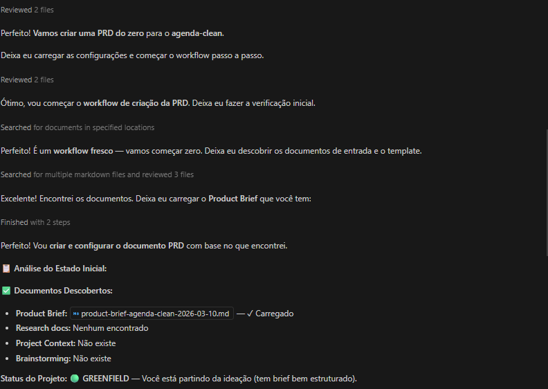

---

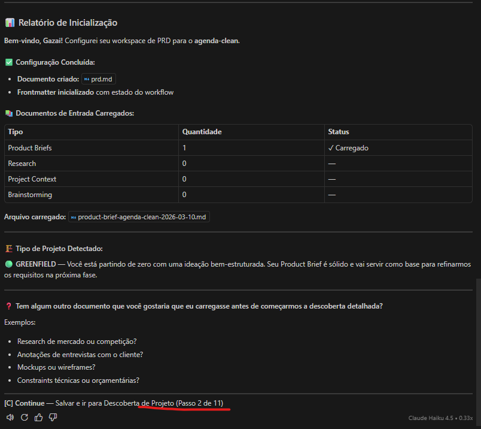

---

Serão **11 passos** para a contrução do PRD. Agora seguiremos respondendo as perguntas e interagindo com o John.

---