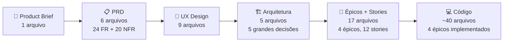

Neste tutorial vamos explorar o uso de **agentes de IA personalizados** — agentes de IA configurados para assumir papéis específicos e te ajudar em tarefas concretas de desenvolvimento. Para isso, vamos usar o **BMAD**, uma metodologia, um framework para desenvolvimento impulsionada por conjunto de agentes prontos que cobrem todo o ciclo de criação de um software: da ideia ao código. Como exemplo prático, vamos acompanhar a construção do **agenda-clean**, um sistema real de agendamento para uma empresa de limpeza de sofá, construído do zero com esses agentes — para que você veja cada conversa, cada decisão e cada artefato gerado ao longo do caminho.

---

## Sumário

- [Preparação: Ambiente e Instalação](#preparação-ambiente-e-instalação)
- [Entendendo as Fases do Processo](#entendendo-as-fases-do-processo)
- [Etapa 0 — Início + Bônus (bmad-help)](#etapa-0---inicio--bônus-bmad-help)
- [Etapa 1 — Análise: A Mary descobre o problema](#etapa-1--análise-a-mary-descobre-o-problema)
- [Etapa 2 — PRD: O John formaliza os requisitos](#etapa-2--prd-o-john-formaliza-os-requisitos)
- [Etapa 3 — UX Design: A Sally define a experiência](#etapa-3--ux-design-a-sally-define-a-experiência)
- [Etapa 4 — Arquitetura: O Winston toma as decisões técnicas](#etapa-4--arquitetura-o-winston-toma-as-decisões-técnicas)
- [Etapa 5 — Épicos e Stories: O Bob organiza o trabalho](#etapa-5--épicos-e-stories-o-bob-organiza-o-trabalho)
- [Etapa 6 — Implementação: A Amelia escreve o código](#etapa-6--implementação-a-amelia-escreve-o-código)
- [Um Desvio: Party Mode](#um-desvio-party-mode)
- [Onde o Projeto Chegou](#onde-o-projeto-chegou)
- [Seu Próximo Passo](#seu-próximo-passo)

---

## Preparação: Ambiente e Instalação

Antes de qualquer coisa, abra o terminal da na sua máquina.
Em windows acionar no teclado a tecla `windows + r ` , digitar cmd e dar `Enter`  vai aparecer o app prompt de comando.
No Linux e MacOS abrir o aplicativo terminal

Agora verifique se as ferramentas necessárias estão instaladas:

**Ver se o nodeJS está instalado**

```bash
node -v        # precisa ser v18 ou superior
```

Se não aparecer `node v.XX.x.x`, instalar em [nodejs.org](https://nodejs.org). Escolher a versão **v24.x.x(LTS)**. 


--


Siga o fluxo de instalação clicando en `Next` até finalizar a instalação.

Após a instação completa, rodar `node -v` novamente e ver se retornou.


**Com o nodejs instalado, vamos ver agora o npm.**

```bash
npm -v         # vem junto com o Node
```

Deve aparecer algo como `npm v.11.9.0`, se não aparecer, conferir a instação no nodejs no passo anterior.

```bash
C:\Seu usuario>npm -v
11.9.0
```

**Agora o git, nosso controle de versão. Vamos testar se já está instalado**

```bash
C:\Seu usuario>git --version
git version 2.40.0.windows.1
```

Deve aparecer algo como `git version 2.43.0`, se não aparecer, instalar em [git-scm.com](https://git-scm.com/install/), escolher versão x64 


Ir dando `Next` até a tela abaixo, onde deve escolher Use Windows default console window.


Ao finalizar a instalação, voltar ao prompt de comando e testar. Se aparec algo assim. Git instalado!

```bash
C:\Seu usuario>git --version
git version 2.53.0.windows.1
```

**Vamos ver se o Docker está instalado.**

```bash
 # testar se o docker está instalado

C:\Seu Usuario> docker -v

#caso apareça uma mensagem como abaixo

'docker' is not recognized as an internal or external command,
operable program or batch file.

#precisa instalar o docker. veja abaixo como instalar
```

Se algum desses falhar, instale antes de continuar. Docker Desktop em [docker.com](https://www.docker.com/products/docker-desktop).


### Tem uma IDE instalada? ###

 Vscode, Cursor, Visual Studio, etc? Caso não tenha, instalar o Vscode em [code.visualstudio.com](https://code.visualstudio.com/download).

Após essa ferramentas instaladas, temos as ferramentas básicas para continuarmos o processo.

### Mas o que um agente de IA?

 **agente de IA**. Um agente é uma instância de um modelo de linguagem (como o GitHub Copilot) que recebe um conjunto de instruções específicas — um papel, um objetivo, um jeito de trabalhar — e age de acordo com elas. Em vez de conversar com um assistente genérico que faz de tudo, você conversa com um especialista configurado para aquela função: ele sabe o que perguntar, o que produzir e quando parar. No contexto do BMAD, cada agente é acionado por um comando no Copilot Chat e assume um papel diferente conforme a etapa do projeto.

 ### E o BMAD?

Pense no BMAD como um **time virtual de especialistas** que vai te acompanhar durante todo o desenvolvimento do projeto. Em vez de você tentar resolver tudo sozinho — o problema de negócio, o design, a arquitetura, o código — o BMAD coloca um especialista diferente em cada etapa: tem o analista que te ajuda a entender o problema, o designer que define como o app vai parecer, o arquiteto que decide a tecnologia, e o dev que realmente escreve o código. Cada um desses "especialistas" é um agente de IA que você aciona pelo GitHub Copilot, e eles conversam com você em linguagem natural, fazem perguntas, tomam decisões e produzem documentos reais que ficam salvos no seu projeto.

Próximo passo é instalar o BMAD

### Instalando o BMAD

No terminal do seu sistema, crie uma pasta para o agenda clean. Onde todo projeto será armazenado, e BMAD será instalado.

```bash
mkdir agenda-clean
cd agenda-clean
```

Pasta criada vamos abrir o vscode já na pasta atual (agenda-clean)

```bash
code . 
```

Agora dentro do vscode abra uma janela do terminal usando o atalho `ctrl+'`

Dentro deste terminal digite o comando

```bash
npx bmad-method@latest install
```

O instalador vai fazer algumas perguntas. Responda assim:

```bash
? Ok to proceed? Y
? Instalation directory: aceitar padrão (Enter)
? Install to this directory Y
? Select models to install: 
#Para selecionar utiliza barra de espaço e para confirmar Enter
# Escolher 
[x] Bmad Core Module
[x] Bmad agile IA drive Development. 
? add custom modules agents or workflows from your computer? N
? Integrate with 
#Para selecionar utiliza barra de espaço e para confirmar Enter
# Escolher 
[x]Claude 
[x]Github copilot 

? What is your project name?  → agenda-clean
? What Should agents call you?   → (seu nome)
? What languages should agnets use when chatting with you?  → Portugues Brazil
? Prefered document output language?  → Portugues Brazil
? Where should output files be saved? aceitar padrão (Enter)
? Model integrations? Express
```

O processo vai iniciar.

Quando terminar, você vai ver uma pasta `_bmad/` criada no projeto.

Reiniciar o vscode.
Abrir uma janela do copilot chat ```Vou colcoar um colocar print aqui```
Selecionar o modo agent no copilot chat```Vou colcoar um colocar print aqui```

Se tudo funcionou bem e você esta na janela do copilot chat...

Abra a janela do Copilot Chat do VS Code e digite `/bmad:DITA:agent:analyst`. Se o agente responder algo semelhantes a isso.

`Olá, {{seu nome}}! 📊 Sou a Mary, sua Analista de Negócios. Estou aqui para transformar ideias vagas em insights concretos — adoro um bom mistério de negócio para desvendar!`

>Sucesso!! O BMAD está instalado e pronto para uso!

---

## Entendendo as Fases do Processo

O BMAD organiza o desenvolvimento em **4 fases**. Nem tudo é obrigatório — o que você precisa executar depende do tamanho e complexidade do projeto.

### Fase 1 — Analysis *(opcional)*

A fase de análise existe para você entender bem o problema **antes** de escrever qualquer requisito. Tudo aqui é opcional, mas o Product Brief é recomendado como ponto de partida para qualquer projeto que não seja trivial.

- **Brainstorming** *(opcional)* — Sessão facilitada de geração de ideias. Agente: Mary (Analyst)
- **Research** *(opcional)* — Pesquisa de mercado, concorrência e viabilidade técnica. Agente: Mary (Analyst)
- **Product Brief** *(recomendado)* — Documento-base que resume o problema, as personas e a proposta de valor. Agente: Mary (Analyst)

### Fase 2 — Planning *(obrigatório)*

Aqui os requisitos são formalizados. Sem essa fase, o Dev não tem base para implementar nada.

- **PRD** *(obrigatório)* — Lista todos os requisitos funcionais e não-funcionais do produto. Agente: John (PM)
- **UX Design** *(obrigatório se o projeto tiver interface)* — Define identidade visual, design system e fluxos de tela. Agente: Sally (UX Designer)

### Fase 3 — Solutioning *(obrigatório no BMAD Method)*

As decisões técnicas são tomadas aqui. O código só começa depois que essa fase estiver completa.

- **Arquitetura** *(obrigatório)* — Stack, banco de dados, estrutura de pastas, padrões de API. Agente: Winston (Architect)
- **Épicos e Stories** *(obrigatório)* — Quebra do trabalho em unidades implementáveis com critérios de aceitação. Agente: John (PM) + Bob (SM)
- **Implementation Readiness Check** *(altamente recomendado)* — Valida que todos os documentos de planejamento estão coerentes entre si antes de começar a codar. Agente: Winston (Architect)

### Fase 4 — Implementation *(obrigatório)*

O código é escrito story a story, seguindo o que foi planejado nas fases anteriores.

- **Sprint Planning** *(obrigatório)* — Inicializa o arquivo de rastreamento do sprint. Agente: Bob (SM)
- **Dev Story** *(obrigatório, por story)* — Implementa cada story com testes. Agente: Amelia (Dev)
- **Code Review** *(recomendado, por story)* — Valida a qualidade do código implementado. Agente: Amelia (Dev)
- **Retrospectiva** *(recomendado, por épico)* — Revisão ao final de cada épico. Agente: Bob (SM)

---

### Resumo visual

```
Fase 1 — Analysis      [OPCIONAL]
  └── Product Brief    ← recomendado
  └── Brainstorming    ← opcional
  └── Research         ← opcional

Fase 2 — Planning      [OBRIGATÓRIO]
  └── PRD              ← obrigatório
  └── UX Design        ← obrigatório se tiver interface

Fase 3 — Solutioning   [OBRIGATÓRIO no BMAD Method]
  └── Arquitetura      ← obrigatório
  └── Épicos + Stories ← obrigatório
  └── Readiness Check  ← altamente recomendado

Fase 4 — Implementation [OBRIGATÓRIO]
  └── Sprint Planning  ← obrigatório
  └── Dev Story        ← obrigatório (repetir por story)
  └── Code Review      ← recomendado
  └── Retrospectiva    ← recomendado (por épico)
```

> **No agenda-clean**, Para o nosso curso, **todas** as **4 fases** serão executadas na ordem. É esse percurso completo que vamos acompanhar nas etapas a seguir.

---

## Etapa 0 - Inicio + Bônus (bmad-help)

Agora que entemos quais etapas vamos passar e que representa cada uma delas, vamos começar a usar de fato o BMAD.

Antes de entrar nas etapas, é importante conhecer o `/bmad-help`. Ele é um assistente de orientação que você pode usar a qualquer momento, de dentro de qualquer agente, para perguntar o que fazer a seguir.

```bash
#Você pode usá-lo de forma genérica
/bmad-help

#ou combinado com o que está tentando resolver, por exemplo:
/bmad-help tenho um brief pronto, qual é o próximo passo?

/bmad-help não sei se minha ideia precisa de análise de mercado`. O agente ativo vai responder com uma orientação contextual baseada na fase em que você está, ajudando você a não se perder no processo.
```

Então, vamos colocar a mão na massa!

---

## Etapa 1 — Análise: A Mary descobre o problema

### Por que começar pela análise?

Sabemos que a tentação é abrir o copilot já começar com um comando do tipo: ***"criar um site de agendar limpeza de sofá"*** ou para alguns outros seria: ***"crie o banco de dados com os campos de usuario, tipo de sofá e data"***, ou ainda, ***desenha a tela do formulário de pedido***. Mas sem entender **o problema real**, você vai construir a solução errada. A Mary existe para forçar essa reflexão antes de qualquer decisão técnica.

### Acionando a Mary

No Copilot Chat, digite:

```
/bmad:DITA:agent:analyst
```

A Mary vai se apresentar com um menu. Selecione a opção de criar um **Product Brief** (geralmente opção `PB` ou número correspondente).

### O que a Mary vai perguntar

A Mary conduz uma entrevista estruturada. Ela não aceita respostas vagas. Para o agenda-clean, as perguntas foram parecidas com estas:

> **Mary:** "Descreva o negócio em uma frase. Quem é o dono e o que ele vende?"

**Resposta dada:** *"Empresa de limpeza de sofá. Um prestador de serviço autônomo que atende residências."*

> **Mary:** "Como os agendamentos são feitos hoje? Qual é o maior problema no processo atual?"

**Resposta dada:** *"Via WhatsApp e ligação. O maior problema é conflito de horário e falta de histórico."*

> **Mary:** "Quem são os usuários do sistema? Há mais de um perfil?"

**Resposta dada:** *"Sim. O cliente (quem agenda o serviço) e o admin (o próprio prestador, que gerencia tudo)."*

> **Mary:** "Você mencionou conflito de horário. Como isso acontece hoje e como o sistema deve resolver?"

**Resposta dada:** *"Acontece porque duas pessoas podem ligar pedindo o mesmo horário. O sistema precisa bloquear automaticamente um horário já ocupado."*

> **Mary:** "Soluções como Google Agenda ou Calendly não resolveriam isso? O que falta nessas opções?"

**Resposta dada:** *"Falta: controle de status do serviço (solicitado, confirmado, em atendimento...), criação de conta automática no primeiro acesso pelo Google, e a simplicidade de um sistema focado nesse nicho específico."*

### O que a Mary produz

Depois de 5 a 8 rodadas de perguntas e respostas, a Mary consolida tudo e escreve o **Product Brief**. Ela salva automaticamente o arquivo:

```
_bmad-output/planning-artifacts/product-brief-agenda-clean-2026-03-10.md
```

O brief tem:

- **Executive Summary** — o problema em 3 frases
- **Personas** — Ana (cliente) e o Gestor (admin), com contexto, dores e fluxo de uso real
- **Proposta de valor** — o que diferencia o agenda-clean de qualquer outro agendador
- **Funcionalidades core** — sem entrar em detalhe técnico; só o que o produto precisa fazer

> **Ponto de aprendizado:** veja como a diferenciação principal não é técnica — é de negócio. "Zero fricção de onboarding com Google OAuth" é uma decisão de produto, não de arquitetura. A Arquitetura vai vir depois, respeitando essa decisão.

Abra o arquivo gerado em `_bmad-output/planning-artifacts/product-brief-agenda-clean-2026-03-10.md` e leia a seção de personas. Repare que a Ana não é uma persona técnica — ela é uma pessoa real com uma dor real. Isso vai guiar todas as decisões de UX mais tarde.

**A etapa está completa quando:** o Product Brief existe em `_bmad-output/planning-artifacts/` e você consegue explicar o problema do sistema em 2 frases sem consultar o documento.

---

## Etapa 2 — PRD: O John formaliza os requisitos

### Por que precisamos do PRD?

O Product Brief diz "o quê" em linguagem de negócio. O PRD transforma isso em **requisitos mensuráveis** que o Arquiteto e o Dev vão usar. Sem o PRD, o Arquiteto não sabe o que precisa suportar, e o Dev não sabe quando uma story está pronta.

### Acionando o John

No Copilot Chat, encerre a Mary (opção `DA`) e ative o PM:

```
/bmad:DITA:agent:pm
```

Selecione a opção de **criar PRD** e passe o caminho do Product Brief quando ele pedir.

### Como a conversa evolui

O John usa o Product Brief como base mas vai **aprofundar cada ponto**. Algumas das perguntas que ele fez:

> **John:** "O brief menciona 'controle de status'. Quais são os status possíveis e quem pode mudar cada um?"

**Decisão tomada:** *Status: `solicitado → confirmado → em_atendimento → concluído / cancelado`. Só o admin muda. O cliente só lê.*

> **John:** "Quando um agendamento é cancelado, o horário deve ficar disponível automaticamente para outro cliente?"

**Decisão tomada:** *Sim. O cancelado não conta como conflito. Isso é uma regra de negócio crítica.*

> **John:** "O sistema precisa enviar notificações (e-mail, WhatsApp) para o cliente quando o status mudar?"

**Decisão tomada:** *Não para o MVP. O cliente verifica o status no sistema.*

> **John:** "Como o sistema vai saber quem é o admin? Haverá múltiplos admins?"

**Decisão tomada:** *Um único admin identificado pelo e-mail (`ADMIN_EMAIL` em variável de ambiente). Múltiplos admins fica para depois do MVP.*

Essas decisões se tornam **requisitos funcionais** numerados no PRD.

### A regra que o John identificou como crítica

Durante a conversa sobre disponibilidade de slots, o John formalizou o requisito mais importante do sistema:

> **FR20:** Sistema impede a criação de dois agendamentos ativos no mesmo dia e horário via validação **enforced no backend**.

E complementou com um requisito não-funcional:

> **NFR11:** Regra de bloqueio de double-booking é enforced no backend via transação atômica, não podendo ser contornada via requisição direta à API.

Repare na palavra "enforced no backend". Isso não é detalhe de implementação — é **requisito de segurança**. Se a validação ficasse só no frontend, um usuário mal-intencionado poderia fazer uma requisição direta à API e criar um conflito de horário. O John não deixou esse ponto vago.

### O que o John produz

O PRD é dividido em vários arquivos dentro de:

```
_bmad-output/planning-artifacts/prd/
├── functional-requirements.md      ← FR1 a FR24
├── non-functional-requirements.md  ← NFR1 a NFR20
├── user-journeys.md                 ← Jornada da Ana, do Carlos, do Gestor
├── product-scope.md
└── success-criteria.md
```

Abra `functional-requirements.md`. O documento tem **24 requisitos funcionais** organizados por área: autenticação, agendamento (cliente), gestão (admin) e regras de negócio. Cada um tem um ID (FR1, FR2...) que vai ser referenciado nas stories da implementação.

**A etapa está completa quando:** você consegue abrir o PRD e dizer, para qualquer requisito, se ele é funcional ou não-funcional e quem é o ator.

---

## Etapa 3 — UX Design: A Sally define a experiência

### Por que definir UX antes do código?

Sem specs de design, o Dev toma decisões visuais enquanto implementa — e essas decisões costumam ser inconsistentes. A Sally define o **design system** e as **regras visuais** antes de qualquer linha de CSS, para que o Dev não precise improvisar.

### Acionando a Sally

```
/bmad:DITA:agent:ux-designer
```

Selecione a opção de criar a especificação de UX e passe o PRD como referência.

### As perguntas da Sally

A Sally vai em uma direção diferente do John — ela pensa em **emoção e contexto de uso**:

> **Sally:** "Onde o cliente vai usar o sistema com mais frequência: celular ou desktop?"

**Decisão tomada:** *Celular. A Ana resolve isso num momento livre, no sofá, com o celular na mão. Mobile-first.*

> **Sally:** "Qual sensação o cliente deve ter ao ver a tela de login pela primeira vez?"

**Resposta dada:** *"Confiança e simplicidade. Não pode parecer genérico nem abandonado."*

> **Sally:** "O admin precisa de um visual diferente do cliente? Ou a mesma identidade?"

**Decisão tomada:** *Visual diferente. O admin está em modo de trabalho — precisa de densidade de informação. O cliente está em modo de consumo — precisa de clareza.*

### Três direções propostas — Party Mode opcional

A Sally propôs três direções visuais diferentes e pediu para decidir entre elas. Em vez de decidir sozinho, você poderia ter ativado o **Party Mode** aqui:

```
/bmad-party-mode
```

No Party Mode, todos os agentes ativos (neste ponto, a Mary, o John e a Sally) discutem juntos. A Mary daria a perspectiva do usuário de negócio, o John olharia para os requisitos de acessibilidade (NFR17), e a Sally apresentaria as três opções. Vocês decidiriam juntos.

Para o agenda-clean, a **Direção A — "Clean Card"** foi escolhida:

| Elemento | Decisão |
|---|---|
| Fundo geral | `#F8F2EF` (off-white quente) |
| Cards | Branco `#FFFFFF` com sombra leve |
| Badge de status | Pill colorido no canto superior direito do card |
| Botão CTA | Laranja `#F23005`, full-width, fixo no rodapé |
| Navegação | Bottom nav (mobile-first): Agendamentos + Logout |

**Por que não a Direção B ou C?** A B usava header escuro que tornava o app mais pesado para um serviço de limpeza (contexto leve). A C usava muito do laranja de destaque, o que cansaria a vista em listagens longas.

### O que a Sally produz

```
_bmad-output/planning-artifacts/ux-design-specification/
├── design-system-foundation.md    ← shadcn/ui como base, tokens definidos
├── design-direction-decision.md   ← A decisão tomada e a justificativa
├── visual-design-foundation.md    ← Cores, tipografia (Inter), espaçamentos
├── fluxos-de-jornada-do-usurio.md ← Fluxos de tela em texto estruturado
└── ...
```

**A etapa está completa quando:** você consegue dizer qual cor de fundo o sistema usa, qual fonte foi escolhida e por que a Direção A foi preferida.

---

## Etapa 4 — Arquitetura: O Winston toma as decisões técnicas

### O que o Arquiteto faz de diferente

O Winston recebe o PRD e o UX Design e responde a uma pergunta simples: **"Com o que vamos construir isso e como?"**. As decisões que ele toma aqui **vinculam todos os agentes posteriores**. O Dev não escolhe o banco de dados, não escolhe a lib de auth, não escolhe como organizar as pastas — o Winston já decidiu.

### Acionando o Winston

```
/bmad:DITA:agent:architect
```

Passe o PRD e a especificação UX como contexto.

### As grandes decisões do Winston

O Winston apresentou as opções e argumentou cada uma. Veja as principais:

**Stack do projeto:**

> *"Para um projeto solo com 2 entidades e 1 admin, Next.js App Router com TypeScript é o caminho. Elimina a necessidade de um backend separado — as API Routes do Next.js fazem esse papel."*

Escolhas finais: **Next.js 15 + TypeScript + Tailwind CSS + shadcn/ui**

**Banco de dados e autenticação:**

> *"Supabase entrega PostgreSQL gerenciado + autenticação com Google OAuth nativo em um único serviço. Elimina Prisma (overhead desnecessário para 2 tabelas), elimina Passport.js e gestão manual de JWT."*

Escolha final: **Supabase (PostgreSQL + Auth)**

**A decisão mais crítica — anti double-booking:**

O Winston identificou o FR20 (bloqueio de conflito de horário) como a decisão técnica mais delicada:

> *"Não fazer isso só na API Route. Uma race condition entre duas requisições simultâneas passaria pela verificação na aplicação e ambas criariam o agendamento. A proteção real está no banco."*

Solução: **Partial UNIQUE index no PostgreSQL**:

```sql
CREATE UNIQUE INDEX unique_active_slot
ON appointments (date, time_slot)
WHERE status != 'cancelado';
```

Isso garante que o próprio banco rejeite o segundo insert com erro `23505` (unique violation), independente de quantas requisições cheguem ao mesmo tempo. A API captura esse erro e retorna HTTP 409.

**Estrutura de pastas:**

```
src/
├── app/
│   ├── (admin)/      ← Route group: só admin entra aqui
│   ├── (client)/     ← Route group: só cliente entra aqui
│   ├── api/          ← Todos os endpoints REST
│   └── login/        ← Única página pública
├── components/       ← Componentes reutilizáveis
├── lib/supabase/     ← Clientes Supabase (browser, server, middleware)
└── types/            ← Tipos TypeScript globais
```

Os parênteses em `(admin)` e `(client)` são uma feature do Next.js App Router — eles criam **route groups** que organizam arquivos sem aparecer na URL.

**Como o middleware protege as rotas:**

```
middleware.ts  ← rodado antes de QUALQUER página
│
├── Sem sessão válida?      → redirect para /login
├── Role = 'client'?        → só acessa /(client)/
├── Role = 'admin'?         → só acessa /(admin)/
└── Como sabe o role?       → email == ADMIN_EMAIL no .env.local
```

### O que o Winston produz

```
_bmad-output/planning-artifacts/architecture/
├── decises-arquiteturais-core.md    ← Todas as decisões em tabelas
├── estrutura-do-projeto-limites.md  ← Árvore completa de diretórios
├── padres-de-implementao...md       ← Regras que o Dev deve seguir
└── resultados-da-validao...md       ← Checklist de completude
```

**A etapa está completa quando:** você consegue explicar, sem consultar o documento, por que o Supabase foi escolhido no lugar do Prisma e como o partial UNIQUE index previne race conditions.

---

## Etapa 5 — Épicos e Stories: O Bob organiza o trabalho

### O que o Scrum Master faz

O Bob recebe toda a documentação produzida até aqui e quebra o trabalho em unidades implementáveis. Ele cria os **épicos** (grandes grupos de funcionalidade) e as **stories** (tarefas de implementação com critérios claros).

### Acionando o Bob

```
/bmad:DITA:agent:sm
```

Selecione a opção de criação de épicos e stories.

### Os 4 épicos criados

O Bob leu o PRD e a arquitetura e dividiu o trabalho assim:

| Épico | O que cobre |
|---|---|
| **Epic 1 — Setup** | Ambiente, projeto Next.js, banco de dados, helpers Supabase, OAuth, deploy |
| **Epic 2 — Autenticação** | Tela de login, callback OAuth (criação de conta automática), logout |
| **Epic 3 — Agendamento (Cliente)** | API de criação, formulário, lista de agendamentos, detalhes |
| **Epic 4 — Admin** | API de listagem, painel com filtro por data, API de status, detalhes + alteração |

Cada épico gera **arquivos de story individuais** em `_bmad-output/implementation-artifacts/`. O Bob cria esses arquivos com dono, critérios e tasks — o Dev só precisa abrir e seguir.

### Anatomia de uma story gerada pelo Bob

Abra `_bmad-output/implementation-artifacts/3-1-api-criacao-agendamento.md`. Repare na estrutura:

```
# Story 3.1: API de Criação de Agendamento com Validação de Double-Booking

Status: done

## Story
Como cliente autenticado,
Quero que o sistema valide a disponibilidade do slot e crie meu agendamento,
Para que eu tenha garantia de que meu horário está reservado sem conflito.

## Acceptance Criteria
1. POST /api/appointments com slot disponível → HTTP 201 + objeto do agendamento
2. POST /api/appointments com slot ocupado  → HTTP 409 + código SLOT_CONFLICT
3. Slot com agendamento cancelado permite novo agendamento
4. POST sem campos obrigatórios → HTTP 400
5. Usuário não autenticado → HTTP 401
6. Requests simultâneas → partial UNIQUE index garante apenas um criado

## Tasks / Subtasks
- [ ] Criar src/app/api/appointments/route.ts
- [ ] Handler POST: validar auth, validar campos, inserir no banco
- [ ] Capturar erro PostgreSQL 23505 → retornar HTTP 409
...
```

Cada critério de aceitação tem um número. Cada task referencia qual critério ela satisfaz. O Dev não precisa adivinhar nada.

### O arquivo de status do sprint

O Bob também cria e mantém `_bmad-output/implementation-artifacts/sprint-status.yaml`:

```yaml
development_status:
  epic-1: done
  epic-2: done
  epic-3: done
  epic-4: done
```

Esse arquivo é o termômetro do projeto. A qualquer momento você pode olhar para ele e saber onde está.

**A etapa está completa quando:** todos os arquivos de story existem em `_bmad-output/implementation-artifacts/` e o sprint-status.yaml lista todos os épicos.

---

## Etapa 6 — Implementação: A Amelia escreve o código

### Como a Amelia trabalha

A Amelia é diferente dos outros agentes — ela **não faz perguntas de produto**. Ela lê uma story, executa as tasks em ordem e marca cada uma como concluída somente quando o código está implementado e os testes passando. Ela não avança para a próxima story com testes falhando.

### Acionando a Amelia

Para cada story, você aciona a Amelia e passa o caminho do arquivo:

```
/bmad:DITA:agent:dev
```

E então diz: *"Implemente a story em `_bmad-output/implementation-artifacts/1-1-inicializar-projeto-nextjs.md`"*

### O que acontece story a story

**Story 1.0 — Preparar ambiente:**

A Amelia verifica as versões de Node, Git e Docker. Cria o projeto Supabase, copia as credenciais para o `.env.local`. Ao final, `docker ps` e `supabase --version` retornam versão sem erros.

**Story 1.1 — Inicializar Next.js:**

```bash
# A Amelia executa estes comandos em sequência:
npx create-next-app@latest agenda-clean \
  --typescript --tailwind --eslint --app --src-dir --import-alias "@/*"

npm install @supabase/supabase-js @supabase/ssr

npx shadcn@latest init --defaults
```

Resultado: `npm run dev` sobe em `localhost:3000` sem erros.

**Story 1.2 — Supabase local e schema:**

A Amelia cria os arquivos de migration em `supabase/migrations/`:

```sql
-- 001_create_users.sql
CREATE TABLE users (
  id UUID PRIMARY KEY REFERENCES auth.users(id),
  email TEXT NOT NULL UNIQUE,
  role TEXT NOT NULL DEFAULT 'client',
  name TEXT,
  created_at TIMESTAMPTZ DEFAULT NOW()
);

-- 002_create_appointments.sql
CREATE TABLE appointments (
  id UUID PRIMARY KEY DEFAULT gen_random_uuid(),
  user_id UUID REFERENCES users(id),
  address TEXT NOT NULL,
  date DATE NOT NULL,
  time_slot TEXT NOT NULL,
  notes TEXT,
  status TEXT NOT NULL DEFAULT 'solicitado',
  created_at TIMESTAMPTZ DEFAULT NOW()
);

-- O índice que previne double-booking:
CREATE UNIQUE INDEX unique_active_slot
ON appointments (date, time_slot)
WHERE status != 'cancelado';
```

**Story 2.1 — Página de login:**

```
src/app/login/page.tsx  ← botão "Entrar com Google" que chama Supabase OAuth
```

**Story 2.2 — Callback OAuth:**

```
src/app/api/auth/callback/route.ts  ← recebe o código do Google, troca por sessão,
                                        cria usuário na tabela users se não existir
```

**Story 3.1 — API de criação de agendamento:**

Aqui a Amelia implementa a lógica mais crítica do sistema. O endpoint `POST /api/appointments` valida a sessão, insere no banco e captura o erro `23505` (violação do partial UNIQUE index) retornando HTTP 409:

```typescript
// src/app/api/appointments/route.ts
const { data, error } = await supabase
  .from('appointments')
  .insert({ user_id: user.id, address, date, time_slot: timeSlot, notes, status: 'solicitado' })
  .select().single()

if (error?.code === '23505') {
  return NextResponse.json(
    { error: { message: 'Horário indisponível.', code: 'SLOT_CONFLICT' } },
    { status: 409 }
  )
}
```

### O Dev Agent Record

Ao finalizar cada story, a Amelia atualiza o arquivo com o que foi feito:

```markdown
## Dev Agent Record
- Implementou POST /api/appointments com validação de auth e conflito
- Partial UNIQUE index capturado via código 23505
- Tipos criados em src/types/index.ts: Appointment, AppointmentStatus, User

## File List
- src/app/api/appointments/route.ts (criado)
- src/types/index.ts (criado)
```

Isso é o histórico real do que foi implementado — não uma estimativa, não um plano. O que está aqui foi feito.

**A etapa está completa quando:** todas as stories têm status `done` no sprint-status.yaml e `npm run dev` sobe o sistema funcionando.

---

## Um Desvio: Party Mode

Em qualquer ponto do processo, você pode ativar o **Party Mode** para reunir todos os agentes e discutir um problema juntosCada agente vai contribuir a partir da sua perspectiva.

```
/bmad-party-mode
```

**Quando faz sentido usar:**

- **Na Etapa 3 (UX):** a Mary contribui com o que a Ana precisa, o John verifica se a escolha visual bate com os requisitos de acessibilidade, a Sally apresenta as direções.
- **Durante a Arquitetura:** a Mary pode questionar se uma decisão técnica impacta negativamente a experiência do usuário de negócio.
- **Antes de fechar o PRD:** todos os agentes revisam se algo ficou de fora.

**Como funciona na prática:**

Você digita `/bmad-party-mode` e descreve o que precisa discutir:

> *"Estamos decidindo entre três direções visuais para o app. Direção A é clean e leve, Direção B tem header escuro, Direção C usa mais cor de destaque. Qual vocês recomendam?"*

Cada agente responde com sua perspectiva. Você modera e toma a decisão. A discussão fica registrada no chat.

---

## Onde o Projeto Chegou

Depois de percorrer todas as etapas, o projeto agenda-clean ficou assim:

**Artefatos gerados (`_bmad-output/`):**

```
planning-artifacts/
├── product-brief-agenda-clean-2026-03-10.md
├── epics.md
├── prd/                          ← 6 arquivos com todos os requisitos
├── architecture/                 ← 5 arquivos de decisões arquiteturais
└── ux-design-specification/      ← 9 arquivos de specs de design

implementation-artifacts/
├── sprint-status.yaml            ← todos os épicos: done
├── 1-0-preparar-ambiente...md
├── 1-1-inicializar-projeto...md
├── 1-2-inicializar-supabase...md
├── 1-3-configurar-helpers...md
├── 1-4-configurar-google-oauth.md
├── 1-5-configurar-deploy-vercel.md
├── 2-1-pagina-de-login...md
├── 2-2-callback-oauth...md
├── 2-3-logout.md
├── 3-1-api-criacao-agendamento.md
├── 3-2-formulario-novo-agendamento.md
├── 3-3-lista-agendamentos-cliente.md
├── 3-4-detalhes-agendamento-cliente.md
├── 4-1-api-listagem-agendamentos-admin.md
├── 4-2-painel-admin-lista-e-filtro.md
├── 4-3-api-alteracao-de-status.md
└── 4-4-detalhes-agendamento-admin.md
```

**Código gerado (`src/`):**

```
src/
├── app/
│   ├── login/page.tsx                    ← login com Google
│   ├── (client)/appointments/            ← área do cliente (3 páginas)
│   ├── (admin)/admin/                    ← painel admin (2 páginas)
│   └── api/appointments/ + auth/        ← 4 API routes
├── components/                           ← 7 componentes reutilizáveis
└── lib/supabase/                         ← 3 clientes (browser, server, middleware)
```

**O fluxo completo em números:**



---

## Seu Próximo Passo

Agora você vai recriar esse processo para uma **barbearia**. O sistema precisa de: login com Google, agendamento de horários de corte, e painel do barbeiro para gerenciar a agenda.

Siga cada etapa na ordem:

1. Instale o BMAD em uma nova pasta: `npx bmad-method@latest`
2. Ative a Mary e crie o Product Brief da barbearia
3. Ative o John e gere o PRD com os requisitos
4. Ative a Sally e defina a direção visual
5. Ative o Winston e tome as decisões de arquitetura
6. Ative o Bob e quebre em épicos e stories
7. Ative a Amelia e implemente story por story

Ao final, seu `_bmad-output/` vai ter todos os artefatos e seu `src/` vai ter o código da barbearia. Você vai ter percorrido o ciclo BMAD completo do zero.
